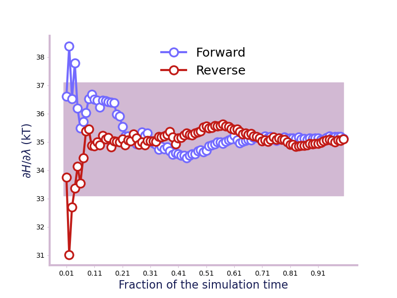

.. module:: alchemlyb.convergence

Assessing convergence
=====================

For a result to be valid, we need to ensure that longer simulation time would not result in different results, i.e., that our results are *converged*. The :mod:`alchemlyb.convergence`  module provides functions to assess the convergence of free energy estimates or other quantities. 

Time Convergence
----------------
One way of determining the simulation end point is to compute and plot the
forward and backward convergence of the estimate using
:func:`~alchemlyb.convergence.forward_backward_convergence` and
:func:`~alchemlyb.visualisation.plot_convergence` [Klimovich2015]_. ::

    >>> from alchemtest.gmx import load_benzene
    >>> from alchemlyb.parsing.gmx import extract_u_nk
    >>> from alchemlyb.visualisation import plot_convergence
    >>> from alchemlyb.convergence import forward_backward_convergence

    >>> bz = load_benzene().data
    >>> data_list = [extract_u_nk(xvg, T=300) for xvg in bz['Coulomb']]
    >>> df = forward_backward_convergence(data_list, 'mbar')
    >>> ax = plot_convergence(df)
    >>> ax.figure.savefig('dF_t.pdf')

Will give a plot looks like this

.. figure:: images/dF_t.png

   A convergence plot of showing that the forward and backward has converged
   fully.

Fractional equilibration time
-----------------------------
Another way of assessing whether the simulation has converged is to check the
energy files. In [Fan2021]_ (and [Fan2020]_), :math:`R_c` and
:math:`A_c` are two criteria of checking the
convergence. :func:`~alchemlyb.convergence.fwdrev_cumavg_Rc` takes a decorrelated
:class:`pandas.Series` as input and gives the metric
:math:`R_c`, which is 0 for fully-equilibrated
simulation and 1 for fully-unequilibrated simulation. ::

    >>> from alchemtest.gmx import load_ABFE
    >>> from alchemlyb.parsing.gmx import extract_dHdl
    >>> from alchemlyb.preprocessing import decorrelate_dhdl, dhdl2series
    >>> from alchemlyb.convergence import fwdrev_cumavg_Rc
    >>> from alchemlyb.visualisation import plot_convergence

    >>> file = load_ABFE().data['ligand'][0]
    >>> dhdl = extract_dHdl(file, T=300)
    >>> decorrelated = decorrelate_dhdl(dhdl, remove_burnin=True)
    >>> R_c, running_average = fwdrev_cumavg_Rc(dhdl2series(decorrelated), tol=2)
    >>> print(R_c)
    0.04
    >>> ax = plot_convergence(running_average, final_error=2)
    >>> ax.set_ylabel("$\partial H/\partial\lambda$ (in kT)")

Will give a plot like this.

The :func:`~alchemlyb.convergence.A_c` on the other hand, takes in a list of
decorrelated :class:`pandas.Series` and gives a metric of how converged the set
is, where 0 fully-unequilibrated and 1.0 is fully-equilibrated. ::

    >>> from alchemlyb.convergence import A_c
    >>> dhdl_list = []
    >>> for file in load_ABFE().data['ligand']:
    >>>     dhdl = extract_dHdl(file, T=300)
    >>>     decorrelated = decorrelate_dhdl(dhdl, remove_burnin=True)
    >>>     decorrelated = dhdl2series(decorrelated)
    >>>     dhdl_list.append(decorrelated)
    >>> value = A_c(dhdl_list, tol=2)
    0.7085

Block Average
--------------
If one obtains suspicious results from the forward / backward convergence plot,
it may be useful to view the block averages of the change in free energy using
:func:`~alchemlyb.convergence.block_average` and
:func:`~alchemlyb.visualisation.plot_block_average` over the course of each 
step in lambda individually, the following example is for :math:`\lambda` = 0

    >>> from alchemtest.gmx import load_benzene
    >>> from alchemlyb.parsing.gmx import extract_u_nk
    >>> from alchemlyb.visualisation import plot_block_average
    >>> from alchemlyb.convergence import block_average

    >>> bz = load_benzene().data
    >>> data_list = [extract_u_nk(xvg, T=300) for xvg in bz['Coulomb']]
    >>> df = block_average(data_list, 'mbar')
    >>> ax = plot_block_average(df)
    >>> ax.figure.savefig('dF_t_block_average.png')

Will give a plot looks like this

   A plot of the free energy divided into block averages showing consistency/inconsistency 
   across the trajectory.

Convergence functions
---------------------

Convergence functions are available from :mod:`alchemlyb.convergence`. Internally, they are imported from submodules, as documented below.

.. currentmodule:: alchemlyb.convergence

.. autosummary::
    :toctree: convergence

    convergence
	      
