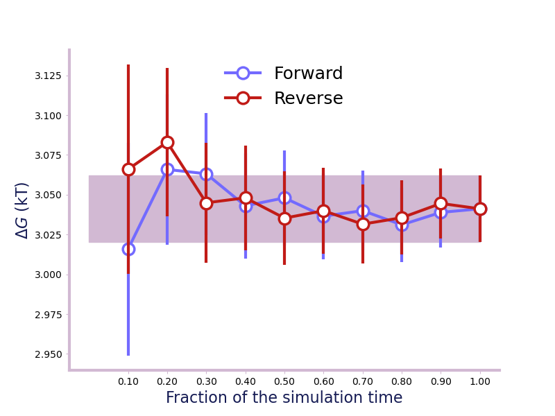

.. module:: alchemlyb.convergence

Using functions to estimate Convergence
=======================================

For a result to be valid, we need to ensure that longer simulation time
would not result in different results. Various functions will be provided in
this module to estimate the convergence of the estimate and help user determine
the simulation end point.

Time Convergence
----------------
One way of determining the simulation end point is to compute and plot the
forward and backward convergence of the estimate using
:func:`~alchemlyb.convergence.forward_backward_convergence` and
:func:`~alchemlyb.visualisation.plot_convergence`. ::

    >>> from alchemtest.gmx import load_benzene
    >>> from alchemlyb.parsing.gmx import extract_u_nk
    >>> from alchemlyb.visualisation import plot_convergence
    >>> from alchemlyb.convergence import forward_backward_convergence

    >>> bz = load_benzene().data
    >>> data_list = [extract_u_nk(xvg, T=300) for xvg in bz['Coulomb']]
    >>> df = forward_backward_convergence(data_list, 'mbar')
    >>> ax = plot_convergence(df)
    >>> ax.figure.savefig('dF_t.pdf')

Will give a plot looks like this

   A convergence plot of showing that the forward and backward has converged
   fully.

Convergence functions
---------------------

The currently available connvergence functions:

.. currentmodule:: alchemlyb.convergence

.. autosummary::
    :toctree: convergence

    convergence

