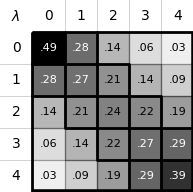

Tutorial
========

In this tutorial, we will demonstrate how to use **alchemlyb** with test data
from `alchemtest`_. This guide provides a general introduction to the tool with
minimal explanations. For more detailed information, please refer to the
relevant sections of the documentation.

Parsing the Free Energy Data
----------------------------

**alchemlyb** requires free energy data obtained from alchemical simulations.
In this example, we use free energy data from Gromacs. Instructions for
reading data from other MD engines are available in the
documentation on :ref:`parsing files <parsing>`. We load the free energy data into a
:mod:`pandas.DataFrame`: ::

    >>> from alchemtest.gmx import load_benzene
    >>> from alchemlyb.parsing.gmx import extract_u_nk

    >>> bz = load_benzene().data
    >>> u_nk_list = [extract_u_nk(xvg, T=300) for xvg in bz['Coulomb']]
    >>> u_nk_list[0]
                             0.0      0.25       0.5       0.75        1.0
    time    fep-lambda
    0.0     0.0         0.309323  3.656838  7.004353  10.351867  13.699382
    10.0    0.0         0.308844  2.616688  4.924532   7.232375   9.540219
    20.0    0.0         0.300940  1.626739  2.952538   4.278337   5.604135
    30.0    0.0         0.309712  1.579647  2.849583   4.119518   5.389453
    40.0    0.0         0.299979  2.255386  4.210794   6.166202   8.121609
    ...                      ...       ...       ...        ...        ...
    39960.0 0.0         0.309339  2.999887  5.690435   8.380983  11.071532
    39970.0 0.0         0.304674  2.313761  4.322848   6.331935   8.341022
    39980.0 0.0         0.305687  2.047583  3.789479   5.531375   7.273271
    39990.0 0.0         0.303546  3.174116  6.044686   8.915256  11.785826
    40000.0 0.0         0.314376  3.021203  5.728030   8.434858  11.141684

    [4001 rows x 5 columns]

Decorrelating the Data
----------------------

The :class:`~alchemlyb.estimators.MBAR` estimator requires decorrelated data.
Various options for decorrelating the data are available in the relevant
documentation on :ref:`subsampling data <subsampling>`. Here, we decorrelate the data using the
following code. ::

    >>> from alchemlyb.preprocessing.subsampling import decorrelate_u_nk

    >>> decorrelated_u_nk_list = [decorrelate_u_nk(u_nk) for u_nk in u_nk_list]
    >>> decorrelated_u_nk_list[0]
                             0.0      0.25       0.5       0.75        1.0
    time    fep-lambda
    0.0     0.0         0.309323  3.656838  7.004353  10.351867  13.699382
    20.0    0.0         0.300940  1.626739  2.952538   4.278337   5.604135
    40.0    0.0         0.299979  2.255386  4.210794   6.166202   8.121609
    60.0    0.0         0.308315  2.284146  4.259977   6.235809   8.211640
    80.0    0.0         0.301432  1.397817  2.494203   3.590589   4.686975
    ...                      ...       ...       ...        ...        ...
    39920.0 0.0         0.305202  2.420299  4.535396   6.650492   8.765589
    39940.0 0.0         0.307156 -0.552737 -1.412630  -2.272523  -3.132416
    39960.0 0.0         0.309339  2.999887  5.690435   8.380983  11.071532
    39980.0 0.0         0.305687  2.047583  3.789479   5.531375   7.273271
    40000.0 0.0         0.314376  3.021203  5.728030   8.434858  11.141684

    [2001 rows x 5 columns]

Estimating Free Energy
----------------------

We estimate the free energy using the :class:`~alchemlyb.estimators.MBAR`
method. More estimators are available in the section on
:ref:`free energy estimators <estimators>`. ::

    >>> from alchemlyb.estimators import MBAR
    >>> import pandas as pd

    >>> mbar = MBAR()
    >>> mbar.fit(alchemlyb.concat(decorrelated_u_nk_list))
    >>> mbar.delta_f_
              0.00      0.25      0.50      0.75      1.00
    0.00  0.000000  1.613595  2.553407  2.983336  3.039517
    0.25 -1.613595  0.000000  0.939812  1.369741  1.425922
    0.50 -2.553407 -0.939812  0.000000  0.429929  0.486110
    0.75 -2.983336 -1.369741 -0.429929  0.000000  0.056181
    1.00 -3.039517 -1.425922 -0.486110 -0.056181  0.000000

Free energy difference between :math:`\lambda = 0` and :math:`\lambda = 1` is ::

    >>> mbar.delta_f_.loc[0.00, 1.00]
    3.039517

Plotting the Diagnostics
------------------------

We can plot the diagnostics of the estimator to assess the
:ref:`overlap metrics <plot_overlap_matrix>`. More information on diagnostics
is available in the relevant section on :ref:`visualisation <visualisation>`: ::

    >>> from alchemlyb.visualisation import plot_mbar_overlap_matrix
    >>> ax = plot_mbar_overlap_matrix(mbar.overlap_matrix)
    >>> ax.figure.savefig('O_MBAR.pdf', bbox_inches='tight', pad_inches=0.0)

This will generate a plot that looks like the one below:

Automated workflow
------------------

The above manual workflow can be automated using the :mod:`~alchemlyb.workflows.ABFE`
workflow class, which demonstrates a best practice implementation for using **alchemlyb** in a end-to-end fashion.

.. SeeAlso::
   See the :ref:`ABFE workflow <abfe-workflow>` section of the documentation for
   more details on how to use :mod:`~alchemlyb.workflows.ABFE`.
   
*Absolute binding free energy* (ABFE) calculations can be analyzed with
two lines of code in a fully automated manner.
All parameters are set when invoking :class:`~alchemlyb.workflows.abfe.ABFE`
and reasonable defaults are chosen for any parameters not set explicitly. The two steps are to

1. initialize an instance of the :class:`~alchemlyb.workflows.abfe.ABFE` class
2. invoke the :meth:`~alchemlyb.workflows.ABFE.run` method to execute the
   complete workflow.
   
As an example, we again use data from a GROMACS ABFE simulation that is available
in alchemtest_. In this case, executing the workflow would look similar
to the following code ::

    >>> from alchemtest.gmx import load_ABFE
    >>> from alchemlyb.workflows import ABFE
    >>> # Obtain the path of the data
    >>> import os
    >>> dir = os.path.dirname(load_ABFE()['data']['complex'][0])
    >>> print(dir)
    'alchemtest/gmx/ABFE/complex'
    >>> workflow = ABFE(units='kcal/mol', software='GROMACS', dir=dir,
    >>>                 prefix='dhdl', suffix='xvg', T=298, outdirectory='./')
    >>> workflow.run(skiptime=10, uncorr='dhdl', threshold=50,
    >>>              estimators=('MBAR', 'BAR', 'TI'), overlap='O_MBAR.pdf',
    >>>              breakdown=True, forwrev=10)

The workflow uses :mod:`~alchemlyb.parsing` to parse the data from the
energy files, remove the initial un-equilibrated frames and decorrelate the data
with :mod:`~alchemlyb.preprocessing.subsampling`. The decorrelated datasets
:ref:`dHdl <dHdl>` and :ref:`u_nk <u_nk>` are then passed to
:mod:`~alchemlyb.estimators` for free energy estimation. The workflow will
also perform a set of analysis that allows the user to examine the quality of
the estimation.
   

.. _alchemtest: https://github.com/alchemistry/alchemtest
