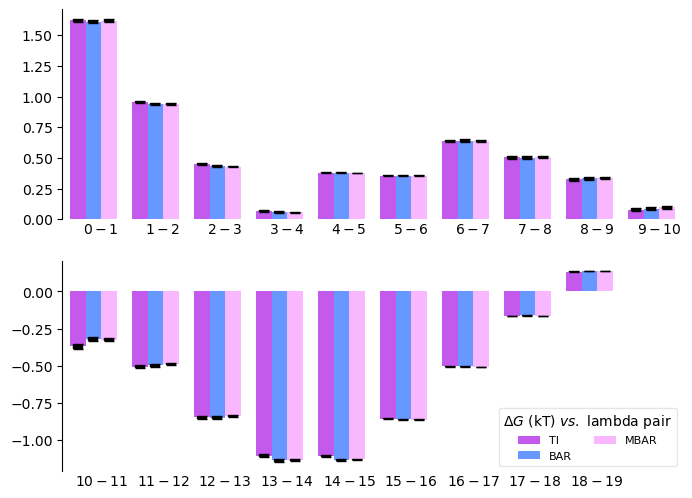

Visualisation of the results
============================
It is quite often that the user want to visualise the results to gain
confidence on the computed free energy. **alchemlyb** provides various
visualisation tools to help user to judge the estimate.

.. currentmodule:: alchemlyb.visualisation

.. autosummary::
    :toctree: visualisation

    plot_mbar_overlap_matrix
    plot_ti_dhdl
    plot_dF_state

.. _plot_overlap_matrix:

Overlap Matrix of the MBAR
--------------------------
The accuracy of the :class:`~alchemlyb.estimators.MBAR` estimator depends on
the overlap between different lambda states. The overlap matrix from the
:class:`~alchemlyb.estimators.MBAR` estimator could be plotted using
:func:`~alchemlyb.visualisation.plot_mbar_overlap_matrix` to check
the degree of overlap. It is recommended that there should be at least
**0.03** [Klimovich2015]_ overlap between neighboring states. ::

    >>> import pandas as pd
    >>> from alchemtest.gmx import load_benzene
    >>> from alchemlyb.parsing.gmx import extract_u_nk
    >>> from alchemlyb.estimators import MBAR

    >>> bz = load_benzene().data
    >>> u_nk_coul = pd.concat([extract_u_nk(xvg, T=300) for xvg in bz['Coulomb']])
    >>> mbar_coul = MBAR()
    >>> mbar_coul.fit(u_nk_coul)

    >>> from alchemlyb.visualisation import plot_mbar_overlap_matrix
    >>> ax = plot_mbar_overlap_matrix(mbar_coul.overlap_matrix)
    >>> ax.figure.savefig('O_MBAR.pdf', bbox_inches='tight', pad_inches=0.0)

Will give a plot looks like this

.. image:: images/O_MBAR.png

.. _plot_TI_dhdl:

dhdl Plot of the TI
-------------------
In order for the :class:`~alchemlyb.estimators.TI` estimator to work reliably,
the change in the dhdl between lambda state 0 and lambda state 1 should be
adequately sampled. The function :func:`~alchemlyb.visualisation.plot_ti_dhdl`
can be used to assess the change of the dhdl across the lambda states.

More than one :class:`~alchemlyb.estimators.TI` estimators can be plotted
together as well. ::

    >>> import pandas as pd
    >>> from alchemtest.gmx import load_benzene
    >>> from alchemlyb.parsing.gmx import extract_dHdl
    >>> from alchemlyb.estimators import TI

    >>> bz = load_benzene().data
    >>> dHdl_coul = pd.concat([extract_dHdl(xvg, T=300) for xvg in bz['Coulomb']])
    >>> ti_coul = TI().fit(dHdl_coul)
    >>> dHdl_vdw = pd.concat([extract_dHdl(xvg, T=300) for xvg in bz['VDW']])
    >>> ti_vdw = TI().fit(dHdl_vdw)

    >>> from alchemlyb.visualisation import plot_ti_dhdl
    >>> ax = plot_ti_dhdl([ti_coul, ti_vdw], labels=['Coul', 'VDW'], colors=['r', 'g'])
    >>> ax.figure.savefig('dhdl_TI.pdf')

Will give a plot looks like this

.. image:: images/dhdl_TI.png

.. _plot_dF_states:

dF States Plots between Different estimators
--------------------------------------------
Another way of assessing the quality of free energy estimate would be comparing
the free energy difference between adjacent lambda states (dF) using different
estimators. The function :func:`~alchemlyb.visualisation.plot_dF_state` can
be used, for example, to compare the dF of both Coulombic and VDW
transformations using :class:`~alchemlyb.estimators.TI`,
:class:`~alchemlyb.estimators.BAR` and :class:`~alchemlyb.estimators.MBAR`
estimators. ::

    >>> from alchemtest.gmx import load_benzene
    >>> from alchemlyb.parsing.gmx import extract_u_nk, extract_dHdl
    >>> from alchemlyb.estimators import MBAR, TI, BAR
    >>> import matplotlib.pyplot as plt
    >>> import pandas as pd
    >>> from alchemlyb.visualisation.dF_state import plot_dF_state
    >>> bz = load_benzene().data
    >>> u_nk_coul = pd.concat([extract_u_nk(xvg, T=300) for xvg in bz['Coulomb']])
    >>> dHdl_coul = pd.concat([extract_dHdl(xvg, T=300) for xvg in bz['Coulomb']])
    >>> u_nk_vdw = pd.concat([extract_u_nk(xvg, T=300) for xvg in bz['VDW']])
    >>> dHdl_vdw = pd.concat([extract_dHdl(xvg, T=300) for xvg in bz['VDW']])
    >>> ti_coul = TI().fit(dHdl_coul)
    >>> ti_vdw = TI().fit(dHdl_vdw)
    >>> bar_coul = BAR().fit(u_nk_coul)
    >>> bar_vdw = BAR().fit(u_nk_vdw)
    >>> mbar_coul = MBAR().fit(u_nk_coul)
    >>> mbar_vdw = MBAR().fit(u_nk_vdw)

    >>> dhdl_data = [(ti_coul, ti_vdw),
                     (bar_coul, bar_vdw),
                     (mbar_coul, mbar_vdw),]

    >>> fig = plot_dF_state(dhdl_data, orientation='portrait')
    >>> fig.savefig('dF_state.pdf', bbox_inches='tight')

Will give a plot looks like this

.. [Klimovich2015] Klimovich, P.V., Shirts, M.R. & Mobley, D.L. Guidelines for
   the analysis of free energy calculations. J Comput Aided Mol Des 29, 397–411
   (2015). https://doi.org/10.1007/s10822-015-9840-9
