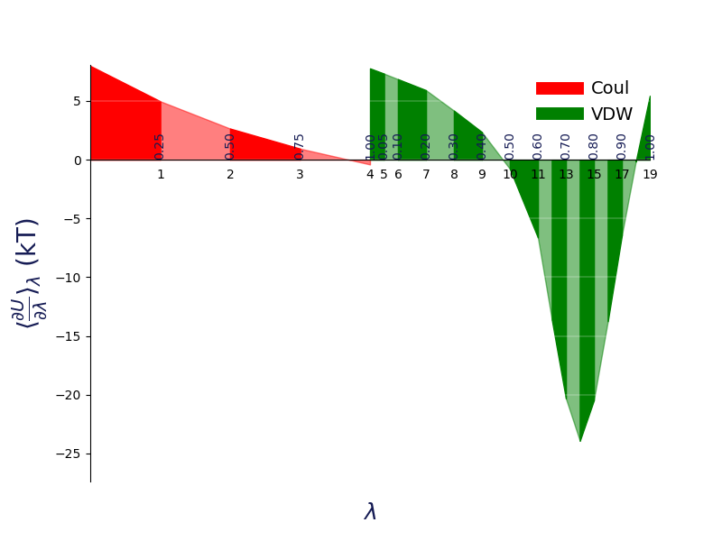

Visualisation of the results
============================
It is quite often that the user want to visualise the results to gain
confidence on the computed free energy. **alchemlyb** provides various
visualisation tools to help user to judge the estimate.

Plotting Functions
------------------
.. currentmodule:: alchemlyb.visualisation

.. autosummary::
    :toctree: visualisation

    plot_mbar_overlap_matrix
    plot_ti_dhdl
    plot_dF_state
    plot_convergence

.. _plot_overlap_matrix:

Overlap Matrix of the MBAR
--------------------------
The accuracy of the :class:`~alchemlyb.estimators.MBAR` estimator depends on
the overlap between different lambda states. The overlap matrix from the
:class:`~alchemlyb.estimators.MBAR` estimator could be plotted using
:func:`~alchemlyb.visualisation.plot_mbar_overlap_matrix` to check
the degree of overlap. It is recommended that there should be at least
**0.03** [Klimovich2015]_ overlap between neighboring states. ::

    >>> import pandas as pd
    >>> from alchemtest.gmx import load_benzene
    >>> from alchemlyb.parsing.gmx import extract_u_nk
    >>> from alchemlyb.estimators import MBAR

    >>> bz = load_benzene().data
    >>> u_nk_coul = alchemlyb.concat([extract_u_nk(xvg, T=300) for xvg in bz['Coulomb']])
    >>> mbar_coul = MBAR()
    >>> mbar_coul.fit(u_nk_coul)

    >>> from alchemlyb.visualisation import plot_mbar_overlap_matrix
    >>> ax = plot_mbar_overlap_matrix(mbar_coul.overlap_matrix)
    >>> ax.figure.savefig('O_MBAR.pdf', bbox_inches='tight', pad_inches=0.0)

Will give a plot looks like this

.. figure:: images/O_MBAR.png

   Overlap between the distributions of potential energy differences is
   essential for accurate free energy calculations and can be quantified by
   computing the overlap matrix 𝐎. Its elements 𝑂𝑖𝑗 are the probabilities of
   observing a sample from state i (𝑖 th row) in state j (𝑗 th column).

.. _plot_TI_dhdl:

dhdl Plot of the TI
-------------------
In order for the :class:`~alchemlyb.estimators.TI` estimator to work reliably,
the change in the dhdl between lambda state 0 and lambda state 1 should be
adequately sampled. The function :func:`~alchemlyb.visualisation.plot_ti_dhdl`
can be used to assess the change of the dhdl across the lambda states.

More than one :class:`~alchemlyb.estimators.TI` estimators can be plotted
together as well. ::

    >>> import pandas as pd
    >>> from alchemtest.gmx import load_benzene
    >>> from alchemlyb.parsing.gmx import extract_dHdl
    >>> from alchemlyb.estimators import TI

    >>> bz = load_benzene().data
    >>> dHdl_coul = alchemlyb.concat([extract_dHdl(xvg, T=300) for xvg in bz['Coulomb']])
    >>> ti_coul = TI().fit(dHdl_coul)
    >>> dHdl_vdw = alchemlyb.concat([extract_dHdl(xvg, T=300) for xvg in bz['VDW']])
    >>> ti_vdw = TI().fit(dHdl_vdw)

    >>> from alchemlyb.visualisation import plot_ti_dhdl
    >>> ax = plot_ti_dhdl([ti_coul, ti_vdw], labels=['Coul', 'VDW'], colors=['r', 'g'])
    >>> ax.figure.savefig('dhdl_TI.pdf')

Will give a plot looks like this

   A plot of ⟨∂𝑈/∂𝜆⟩ versus 𝜆 for thermodynamic integration, with filled areas
   indicating free energy estimates from the trapezoid rule. Different 𝛥𝐺
   components are shown in distinct colors: in red is the electrostatic 𝛥𝐺
   component (𝜆 indices 0–4), while in green is the van der Waals 𝛥𝐺 component
   (𝜆 indices 5–19). Color intensity alternates with increasing 𝜆 index.

.. _plot_dF_states:

dF States Plots between Different estimators
--------------------------------------------
Another way of assessing the quality of free energy estimate would be comparing
the free energy difference between adjacent lambda states (dF) using different
estimators [Klimovich2015]_. The function :func:`~alchemlyb.visualisation.plot_dF_state` can
be used, for example, to compare the dF of both Coulombic and VDW
transformations using :class:`~alchemlyb.estimators.TI`,
:class:`~alchemlyb.estimators.BAR` and :class:`~alchemlyb.estimators.MBAR`
estimators. ::

    >>> from alchemtest.gmx import load_benzene
    >>> from alchemlyb.parsing.gmx import extract_u_nk, extract_dHdl
    >>> from alchemlyb.estimators import MBAR, TI, BAR
    >>> import matplotlib.pyplot as plt
    >>> import pandas as pd
    >>> from alchemlyb.visualisation.dF_state import plot_dF_state
    >>> bz = load_benzene().data
    >>> u_nk_coul = alchemlyb.concat([extract_u_nk(xvg, T=300) for xvg in bz['Coulomb']])
    >>> dHdl_coul = alchemlyb.concat([extract_dHdl(xvg, T=300) for xvg in bz['Coulomb']])
    >>> u_nk_vdw = alchemlyb.concat([extract_u_nk(xvg, T=300) for xvg in bz['VDW']])
    >>> dHdl_vdw = alchemlyb.concat([extract_dHdl(xvg, T=300) for xvg in bz['VDW']])
    >>> ti_coul = TI().fit(dHdl_coul)
    >>> ti_vdw = TI().fit(dHdl_vdw)
    >>> bar_coul = BAR().fit(u_nk_coul)
    >>> bar_vdw = BAR().fit(u_nk_vdw)
    >>> mbar_coul = MBAR().fit(u_nk_coul)
    >>> mbar_vdw = MBAR().fit(u_nk_vdw)

    >>> estimators = [(ti_coul, ti_vdw),
                     (bar_coul, bar_vdw),
                     (mbar_coul, mbar_vdw),]

    >>> fig = plot_dF_state(estimators, orientation='portrait')
    >>> fig.savefig('dF_state.pdf', bbox_inches='tight')

Will give a plot looks like this

.. figure:: images/dF_states.png

   A bar plot of the free energy differences evaluated between pairs of adjacent
   states via several methods, with corresponding error estimates for each method.

.. _plot_convergence:

Forward and Backward Convergence
--------------------------------
One way of determining the simulation end point is to plot the forward and
backward convergence of the estimate using
:func:`~alchemlyb.visualisation.plot_convergence`.

Note that this is just a plotting function to plot [Klimovich2015]_ style
convergence plot. The user need to provide the forward and backward data list
and the corresponding error. ::

    >>> import pandas as pd
    >>> from alchemtest.gmx import load_benzene
    >>> from alchemlyb.parsing.gmx import extract_u_nk
    >>> from alchemlyb.estimators import MBAR

    >>> bz = load_benzene().data
    >>> data_list = [extract_u_nk(xvg, T=300) for xvg in bz['Coulomb']]
    >>> forward = []
    >>> forward_error = []
    >>> backward = []
    >>> backward_error = []
    >>> num_points = 10
    >>> for i in range(1, num_points+1):
    >>>     # Do the forward
    >>>     slice = int(len(data_list[0])/num_points*i)
    >>>     u_nk_coul = alchemlyb.concat([data[:slice] for data in data_list])
    >>>     estimate = MBAR().fit(u_nk_coul)
    >>>     forward.append(estimate.delta_f_.iloc[0,-1])
    >>>     forward_error.append(estimate.d_delta_f_.iloc[0,-1])
    >>>     # Do the backward
    >>>     u_nk_coul = alchemlyb.concat([data[-slice:] for data in data_list])
    >>>     estimate = MBAR().fit(u_nk_coul)
    >>>     backward.append(estimate.delta_f_.iloc[0,-1])
    >>>     backward_error.append(estimate.d_delta_f_.iloc[0,-1])

    >>> from alchemlyb.visualisation import plot_convergence
    >>> ax = plot_convergence(forward, forward_error, backward, backward_error)
    >>> ax.figure.savefig('dF_t.pdf')

Will give a plot looks like this

.. figure:: images/dF_t.png

   A convergence plot of showing that the forward and backward has converged
   fully.

.. [Klimovich2015] Klimovich, P.V., Shirts, M.R. & Mobley, D.L. Guidelines for
   the analysis of free energy calculations. J Comput Aided Mol Des 29, 397–411
   (2015). https://doi.org/10.1007/s10822-015-9840-9
